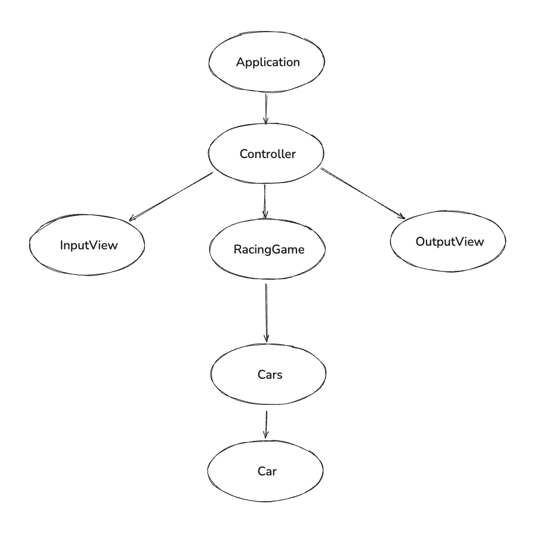

## 들어가며

우테코 8기 프리코스 2주차 미션이 공개되어 요구사항을 분석하고 설계하는 과정을 기록해보려 한다.

## 과제 진행 요구사항
이전 주차와 동일하다.

## 프로그래밍 요구사항
이번 프로그래밍 요구사항에는 1주차와 다르게 많은 부분들이 추가 되었다. 

추가된 부분은 다음과 같다. 
1. indent(인덴트, 들여쓰기) depth를 3이 넘지 않도록 구현한다. 2까지만 허용한다.
    예를 들어 while문 안에 if문이 있으면 들여쓰기는 2이다.
    힌트: indent(인덴트, 들여쓰기) depth를 줄이는 좋은 방법은 함수(또는 메서드)를 분리하면 된다.
2. 3항 연산자를 쓰지 않는다.
3. 함수(또는 메서드)가 한 가지 일만 하도록 최대한 작게 만들어라.
4. JUnit 5와 AssertJ를 이용하여 정리한 기능 목록이 정상적으로 작동하는지 테스트 코드로 확인한다.

추가된 부분들을 보면 이번 주차부터 코드를 최대한 클린하게, 또한 명확하게 짜야한다는 것을 알 수 있다. 또한 '함수(또는 메서드)가 한 가지 일만 하도록 최대한 작게 만들어라.' 이 부분에서 최대한 객체지향 적으로 코드를 설계하고 작성해야함을 알 수 있다.

### 백엔드 공통 피드백 
1주차가 끝난 후 디스코드에 올라온 백엔드 공통 피드백은 다음과 같다. 내가 1주차때 지키지 못한 부분들도 간혹 보여서 이번 주차때부터는 신경써서 프로그램을 작성해야겠다고 다짐해본다.

- 요구 사항을 정확히 준수한다
- 기본적인 Git 명령어를 숙지한다
- Git으로 관리할 자원을 고려한다
- 커밋 메시지를 의미 있게 작성한다
- 의미 없는 주석을 달지 않는다
- 코드 포매팅을 사용한다
- Java에서 제공하는 API를 적극 활용한다
- 배열 대신 컬렉션을 사용한다
- 커밋 메시지에 이슈 또는 PR 번호를 포함하지 않는다
- 풀 리퀘스트를 닫지 말고 추가 커밋을 한다
- 오류를 찾을 때 출력 함수 대신 디버거를 사용한다
- 이름을 통해 의도를 드러낸다
- 축약하지 않는다
- 공백도 코딩 컨벤션이다
- 공백 라인을 의미 있게 사용한다
- 스페이스와 탭을 혼용하지 않는다

## 기능 요구사항 
이번 2주차 미션은 초간단 `자동차 경주` 게임을 구현하는 것이다. 기능 요구사항은 아래와 같다

- 주어진 횟수 동안 n대의 자동차는 전진 또는 멈출 수 있다.
- 각 자동차에 이름을 부여할 수 있다. 전진하는 자동차를 출력할 때 자동차 이름을 같이 출력한다.
- 자동차 이름은 쉼표(,)를 기준으로 구분하며 이름은 5자 이하만 가능하다.
- 사용자는 몇 번의 이동을 할 것인지를 입력할 수 있어야 한다.
- 전진하는 조건은 0에서 9 사이에서 무작위 값을 구한 후 무작위 값이 4 이상일 경우이다.
- 자동차 경주 게임을 완료한 후 누가 우승했는지를 알려준다. 우승자는 한 명 이상일 수 있다.
- 우승자가 여러 명일 경우 쉼표(,)를 이용하여 구분한다.
- 사용자가 잘못된 값을 입력할 경우 IllegalArgumentException을 발생시킨 후 애플리케이션은 종료되어야 한다.

요구사항을 보았을 때 저번 주차와 난이도는 비슷하지만 설계해야할 부분이 많아졌다는 것을 알 수 있다. 요구사항도 많아졌고 지켜야할 부분들이 많아졌기 때문에 1주차에서 아쉬웠던 점을 최대한 반영하여 설계에 들어가보자 한다.

## 설계 과정
### 기능 요구사항 분석
설계를 시작하기 전에 먼저 기능 요구사항에서 저번처럼 명사와 동사를 분리해보면 다음과 같다. 

객체 후보군(명사)
- 자동차 (n대)
- 이름 (각 자동차의)
- 횟수 (이동 횟수)
- 우승자 (한 명 이상)
- 무작위 값 (0~9)
- 사용자
- 게임

행위 후보군(동사)
- 전진하다 / 멈추다
- 부여하다 (이름을)
- 출력하다 (자동차 상태를)
- 구분하다 (쉼표로)
- 입력하다 (이동 횟수를)
- 구하다 (무작위 값을)
- 완료하다 (게임을)
- 알려주다 (우승자를)
- 발생시키다 (예외를)

### 클래스 후보 도출 
추출한 명사와 동사를 바탕으로 클래스를 설계해보자 

#### Car
자동차 경주이기 때문에 Car 클래스는 명확히 존재한다. 또한 Car이 가져야하는 상태는 다음과 같고
1. 이름
2. 위치

가져야하는 역할은 다음과 같다. 
- 전진 여부
- 이름 검증 
 
#### Cars
처음엔 List<Car>로 관리하면 될 것 같았지만 요구사항에 여러 자동차에 관련된 로직들이 있는데 이런 로직들을 Car나 다른 로직에 담당시키는 것은 복잡해지고 코드가 명확해지지 않을 것 같아서 Cars로 분리하는게 좋을 것 같다. 
1. 이름 중복 검증
2. 여러 차를 이동 시키기
3. 우승자 찾기 

#### RacingGmae
자동차 경주 전체를 관리하는 클래스가 필요하다고 생각한다.

하지만 Cars와 RacingGames를 분리하지 않고 한꺼번에 작성할 수 있지 않을까 했지만 이렇게 설계하면 각 객체들이 무거워지는 것을 방지할 수 있다.
1. Car는 자동차들의 집합을 담당함
2. RacingGame은 게임의 규칙을 담당함 

#### View
1. InputView
2. OutputView

Application에서 직접 입력을 받는 방법도 있었지만 요구사항에서 메서드는 하나의 일만 전담하는 것이 좋다고 하기도 하였고 이번엔 View를 도입하여 계층들을 명확히 분리해보려고 한다. 

#### Controller 
View를 도입하고 Domain을 구분하였으니 MVC의 냄새가 강력하게 나긴 한다. 또한 게임의 전반적인 흐름을 명확히 관리해주는 역할의 무언가가 필요하다고 생각했고 이름이 Controller만한 것이 없어 Controller을 도입하려고한다.

## 클래스 구조도
설계한 클래스를 도식화 해보면 다음과 같다.

## 마치며
1주차에서 아쉬웠던 부분을 보완하고 2주차를 잘 진행해보아야겠다.