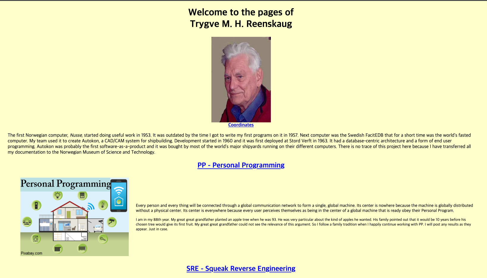
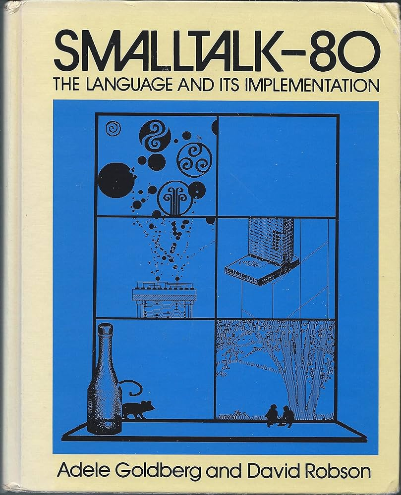

## 들어가며
벌써 우테코 프리코스의 2주차가 지나가고 3주차가 절반이나 지났다. 지난 2주차 미션에서 MVC의 도입을 결정하고 view 와 domain을 분리시키는 데에는 성공했지만 Controller의 역할이 모호해서 결국 Application에 중간 제어 로직을 모두 담았다. 과연 이 방법이 옳았을까? 그리고 과연 내가 MVC를 정확히 알고 도입한 것일까? 답은 아닌 것 같다. 

백엔드 개발을 배우면서 Spring 프레임워크를 자연스럽게 배우다보니 Spring은 Model, Controller, View를 분리하는 MVC를 써야해 까지 알게 되었지만 MVC가 어떻게 생겨났고 정확히 왜 쓰는지에 관한 물음에는 쉽게 답변할 수 없을 것 같다. 그렇다면 지금이라도 MVC가 어떻게 생겨났고 정확히 어떤 것인지 알아야 앞으로 남은 3번의 미션에서 **정확히** 사용할 수 있지 않을까? 

## MVC 
MVC 패턴이 유용하다는 것은 정말 질리도록 들어왔다. 웹 프로그래밍에 가장 최적화 되어있고, 많이 쓰이는 아키텍쳐. 계층의 분리로 각자의 역할에 집중할 수 있게 끔 개발하여 유지보수, 애플리케이션의 확장성의 장점을 가져갈 수 있는. 하지만 이런 정론처럼 여겨지는 MVC가 왜 필요했고 어떻게 발전해왔는지는 정확히 모르겠다. 정말 많은 래퍼런스가 있지만 출처가 명확한 래퍼런스를 통해서 MVC를 알아봐야겠다. 일단 MVC의 역사부터 찾아보자.

## MVC의 탄생

MVC의 역사에 대해 알아보니 쉽게 MVC의 초기 아이디어의 탄생을 알 수 있었다. MVC는 1979년 Trygve Reenskaug에 의해 처음 고안되었던 아이디어라고 한다. 

검색을 하다보니 이 분의 html페이지를 찾을 수 있었는데 발자취가 담겨진 페이지였다. 그 중 [MVC XEROX PARC 1978-79](https://folk.universitetetioslo.no/trygver/themes/mvc/mvc-index.html)에는 MVC의 초기 아이디어에 관한 pdf와 관련 논문들이 링크되어있었고 어떻게 고안된 아이디어였는지 정말 세세하게 기록되어있었다. 

또한 여기서 아래와 같은 문구를 발견할 수 있었는데 처음 고안한 건 Trygve Reenskaug가 맞지만 이 분이 연구소를 나간 뒤 Smalltalk에서 정립된 아이디어인 것을 알 수 있었다. 

> I have sometimes been given more credit than is my due, so I should stress that I am not one of the original inventors of Smalltalk. 
{: .prompt-tip }
## Smalltalk?
Smalltalk은 1970년대 Xerox PARC에서 개발된 객체지향 프로그래밍 언어다. GUI(Graphical User Interface)와 이벤트 기반 프로그래밍의 초석을 마련한 언어이기도 하다. 우리가 알고 있는 MVC(Model–View–Controller)는 바로 이 Smalltalk 환경에서 처음 구체화되었다.

Trygve Reenskaug가 처음 제시한 개념은 “Thing–Model–View–Editor”였다. 사용자가 다루는 사물(Thing) 과 이를 표현하는 모델(Model), 그리고 이를 조작하는 뷰(View) 와 편집기(Editor) 의 분리를 제안한 것이다. 이후 Smalltalk 팀은 이 개념을 단순화하고 실용화하여 오늘날의 MVC 형태로 발전시켰다.

즉, Smalltalk의 MVC는 단순히 코드를 세 부분으로 나누는 설계 방식이 아니라 GUI 환경에서 사용자 입력과 모델 상태를 동기화하기 위한 이벤트 중심 구조였다. 모델이 변경되면 관찰자(observer)인 뷰가 자동으로 업데이트되고, 사용자의 조작은 컨트롤러를 통해 모델로 전달되었다.

이후 Smalltalk 팀은 MVC 구조를 Smalltalk-80 시스템의 GUI 아키텍처에 반영했고 1983년 Adele Goldberg와 David Robson이 지은 『Smalltalk-80: The Language and its Implementation』에서 공식적으로 문서화되었다.

## After Smalltalk 80
이후 MVC는 Smalltalk을 넘어 다양한 환경에 적용되었다. 그러나 1990년대 후반 웹 애플리케이션이 본격적으로 발전하면서 MVC는 새로운 한계에 직면했다. Smalltalk의 MVC가 데스크톱 GUI를 위한 이벤트 기반 구조였다면 웹은 HTTP의 stateless한 특성과 요청–응답 모델을 기반으로 하기 때문에 기존 방식과는 맞지 않았다.

이러한 변화에 따라 웹 환경에 맞게 재해석된 MVC 프레임워크들이 등장했다. 2000년대 초반의 Apache Struts를 시작으로, Ruby on Rails, Django, ASP.NET MVC, Spring MVC 등이 등장하며 각 언어로 MVC를 구현했다. 이후 Laravel, Express.js 등으로 확장되며 MVC는 오늘날까지도 웹 애플리케이션 구조의 중요한 설계 패턴이 되었다.

## Martin Fowler, 『GUI Architectures』
MVC는 달라져왔다. 그렇다면 나는 내 코드에 어떤 MVC를 적용해야할까? 출처가 명확한, 잘 쓰여진 글들을 찾던 도중 리팩토링의 저자 Martin Fowler의 [『GUI Architectures』](https://martinfowler.com/eaaDev/uiArchs.html) 라는 글을 발견할 수 있었다. 이 글은 과거 GUI 프로그램의 구조부터 Smalltalk-80의 MVC, 그리고 현대의 MVP, MVVM 아키텍처까지 명확하게 설명하고 있다. 따라서 나는 이 글을 바탕으로 MVC가 어떻게 변화해왔는지 그리고 나는 어떤 형태로 이해하고 적용해야 하는지 정리해보려 한다.

Martin Fowler는 글의 도입부에서 이렇게 못을 박는다.

> The best way to think of MVC is as set of principles including the separation of presentation from 
domain logic and synchronizing presentation state through events (the observer pattern).
{: .prompt-warning}

1. presentation을 domain logic에서 분리할 것
2. presentation state를 event(observer)로 동기화할 것 

MVC가 변형되어왔고 모든 사람들이 각기 달리 이해하고 있지만 이 두 가지가 MVC의 핵심이며 꼭 지켜야할 MVC의 본질이다.

## Forms and Controls

Martin Fowler는 MVC 이전의 GUI 구조부터 설명한다. 초기 GUI 프로그래밍에서는 Forms and Controls 모델이 주를 이뤘는데 이 방식은 1990년대 클라이언트-서버 개발 도구들이 장려했던 아키텍처다.

Forms and Controls의 핵심은 form이 재사용 가능한 control을 사용하는 구조다. 폼은 layout과 form logic과 같은 책임을 가진다. 또한 이 구조에서 데이터는 아래 세 가지 형태로 존재한다.

> 1. Record state: 데이터베이스에 저장된 영구적 데이터
> 2. Session state: 애플리케이션의 in-memory Record Sets에 존재하는 임시 데이터
> 3. Screen state: GUI 컴포넌트 내부에 표시되는 데이터
{: .prompt-info }

이 세 가지 상태를 동기화하는 메커니즘이 바로 Data Binding이다. Data Binding은 컨트롤의 데이터나 Record Set이 변경되면 즉시 상대방에게 전파되도록 한다.

그러나 Data Binding으로 모든 것을 해결할 수는 없었다. 글에 나오는 예시에서의 variance 계산처럼 애플리케이션 특화 로직은 폼에 위치해야 했기 때문에 events 메커니즘이 사용되었다. 컨트롤은 이벤트를 발생시키고 폼은 이를 관찰하여 핸들러 메서드를 실행한다.

Fowler는 이를 다음과 같이 요약한다:

> Developers write application specific forms that use generic controls. The form describes the layout of controls on it. The form observes the controls and has handler methods to react to interesting events raised by the controls.
{: .prompt-info }

## Model View Controller
이제 본격적으로 Martin Fowler가 말하는 MVC를 살펴보자. Martin은 다음과 같이 또 경고하면서 문단을 시작한다. 그만큼 MVC 패턴은 해석과 이해, 구현 방식이 다양하고 오용되는 경우가 있지 않아서이지 않을까 생각해본다.

> Probably the widest quoted pattern in UI development is Model View Controller (MVC) - it's also the most misquoted.
{: .prompt-warning}

### Model: Separated Presentation
시간이 지나고 MVC의 해석이 바뀌었지만, Martin Fowler가 말하는 MVC의 핵심(At the heart of MVC)은 `Separated Presentation`이다. 현실세계에 대한 우리의 인식을 모델링하는 도메인 객체들과 화면에서 보는 GUI 요소들인 프레젠테이션 객체들 사이에 명확한 구분을 만들어야 한다. 도메인 객체들은 완전히 독립적이어야 하며 프레젠테이션에 대한 참조 없이 작동해야 하고, 여러 프레젠테이션을 동시에 지원할 수 있어야 한다.

### View & Controller: Observer Synchronization
Domain이 독립적이고 표현 계층과 분리되었다면, 남은 것은 View와 Controller의 역할이다. Controller는 사용자의 입력을 받아서 그것으로 무엇을 할지 결정하는 것이며, 뷰와 컨트롤러는 각각 한 쌍을 이룬다는 것을 강조한다.

여기서 듣기만 했던Observer 패턴이 등장한다. 이는 MVC에 귀속된 핵심 아이디어 중 하나다. 모든 view와 controller는 model을 관찰하는 방식으로 동작하는데, 중요한 점은 controller가 view 자체에 값을 직접 설정하지 않는다는 것이다. Controller는 model만 업데이트하고, observer 메커니즘이 나머지 업데이트를 처리하도록 맡긴다.

이것은 Forms and Controls 접근법과 다르다. Forms and Controls에서는 폼이 컨트롤을 직접 업데이트하고 데이터 바인딩에 의존하여 underlying record-set을 업데이트한다.

### Flow Synchronization vs Observer Synchronization
이 두 스타일을 그는 [Flow Synchronization](https://martinfowler.com/eaaDev/FlowSynchronization.html)과 [Observer Synchronization](https://martinfowler.com/eaaDev/MediatedSynchronization.html) 패턴으로 설명한다. 

둘의 동기화 방법을 요약하면 다음과 같다.

>- Flow Synchronization (Forms and Controls): 애플리케이션의 흐름을 통해 업데이트가 필요한 여러 컨트롤을 직접 조작하여 동기화하는 방식
>- Observer Synchronization (MVC): 모델을 업데이트하고 그 모델을 관찰하는 뷰들이 자동으로 업데이트되도록 observer 관계에 의존하는 방식
{: .prompt-info }

Observer Synchronization의 장점은 컨트롤러가 다른 위젯들이 무엇을 변경해야 하는지 알 필요가 없다는 것이다. 특히 같은 모델 객체를 보는 여러 화면이 열려있을 때 유용하다. 예제에 나오는 스프레드시트 화면과 그래프 화면이 동시에 열려있다면, 스프레드시트는 다른 화면이 열려있는지 알 필요 없이 그저 모델만 변경하면 된다.

하지만 코드를 읽는 것만으로는 무슨 일이 일어나는지 알 수 없다는 치명적인 단점이 있다. 그도 Smalltalk 80을 이해할 때 디버거와 스택 트레이스를 따라가야 했다고 이야기할만큼 Observer는 암묵적이고 디버깅이 어렵다는 치명적인 단점이 있다.

### View Logic의 문제와 Presentation Model
MVC의 또 다른 문제는 View 로직을 정확히 어디에 둘 것이냐이다. 글에 나오는 예제에서 생상을 설정하는 로직을 생각해보면 색상은 도메인이 아닌 view의 관심사이지만 좋다, 나쁘다의 판단은 분명 도메인의 로직이다. 그는 이 문제에 대해서 네 가지 해결책을 제시하는데 

1. 도메인의 무결성을 타협 - 가장 간단한 해결책이지만 권장하지 않는다.
2. Assessment screen view가 variance field를 관찰 - variance가 변경되면 assessment screen이 반응해서 색상을 설정한다. 하지만 observer를 더 많이 사용할수록 복잡도가 매우 증가한다.
3. 새로운 UI 컨트롤 - Smalltalk에서는 이를 쉽게 만들었지만 다른 환경에서는 어려울 수 있다.
4. Presentation Model 사용 - 화면 지향적이면서도 독립적인 모델 객체를 만들어서 도메인 객체와 같은 메서드는 위임하고 UI 에만 관련된 메서드를 추가하는 방식인데 이 마지막 옵션이 현재 MVVM과 같은 패턴에서도 사용되는 방식이다.

또한 Presentation State 문제도 있는데 데이터 변경 시에만 활성화되는 저장 버튼은 모델 자체가 아니라 모델과의 상호작용에 관한 상태여서 표현 계층을 어디에 둘 지에 대한 논의가 필요하다. Presentation Model은 이런 상태를 둘 장소를 제공한다.

## VisualWorks Application Model
ParcPlace의 VisualWorks는 view logic과 view state 문제를 해결하기 위해 Application Model이라는 중간 계층을 도입했다. 도메인과 위젯 사이에 중간 계층을 두어서 UI에 특화된 로직과 상태를 분리하기 위해 만든 것인데 이는 Property Object를 통해 매핑시켜 `위젯 → Application Model의 Property Object → Domain Object`로 동작하게끔 연결한다.

하지만 복잡한 동작을 위해서는 Application Model이 위젯을 직접 조작하는 경우가 많아서 이는 Presentation Model이 아니라며 많은 사람들에게 선택받지 못한 방식이 되었고 이에따라 MVP 모델이 발전하게 된다.

### Model-View-Presenter (MVP)

MVP 모델은 1990년대 IBM과 Taligent에서 등장했고, Dolphin Smalltalk 개발자들에 의해 대중화되었다. Forms and Controls(이해하기 쉬운 구조)와 MVC(Separated Presentation)의 장점을 통합시킨 최적화된 모델이라고 할 수 있다.
- View는 위젯의 구조를 정의하고 View/Controller 분리 제거하며 사용자 이벤트를 Presenter에 위임만 하고
- Presenter는 이벤트에 어떻게 반응할 지 결정하고 모델과 복잡한 view의 로직을 처리한다.
- Model은 당연하게 도메인 로직을 담고있고 Observer Synchronization으로 view를 업데이트한다.

기본적인 MVP는 이렇지만 두 가지 변형의 형식이 생긴다. Supervising Controller 형식과 Passive View 형식인데 Supervising Controller 형식은 View가 선언적으로 처리 가능한 단순 로직을 담당하고, Presenter가 복잡한 케이스만 처리하지만 Passive View 형식은 Presenter가 모든 위젯 조작을 담당하여 테스트의 용이성을 극대화 시킨다. 

그는 Supervising Controller로 MVP의 핵심을 다음과 같이 마무리한다. 
> - User gestures are handed off by the widgets to a Supervising Controller. 
> - The presenter coordinates changes in a domain model.
> - Different variants of MVP handle view updates differently. These vary from using Observer Synchronization to having the presenter doing all the updates with a lot of ground in-between.
{: .prompt-info }

## 그래서 나의 MVC는? 
사실 많은 글과 래퍼런스를 읽어도 정확한 MVC가 무엇일까?에 대한 결론은 내릴 수 없을 것 같다. 요구사항마다, 쓰는 언어,에 따라 방식이 매우 상이하기 떄문이다. 하지만 많은 글에서 강조하고 있는 MVC의 정수인 separation of presentation from domain logic와 synchronizing presentation state through events 이 두 가지는 내가 지켜야만했었고 앞으로 지켜야할 MVC이자 객체지향 코드의 가치이지 않을까 생각한다. 

2주차 미션때 내가 한 것을 돌이켜보면 View와 Domain은 분리하였지만 Controller가 모든 데이터를 직접 전달하고 있었기 때문에 view와 domain이 서로 알 수 밖에 없었다. 하지만 접근 자체는 MVP의 Supervising Controller와 가장 유사했고 프리코스에서 사용하기 가장 좋은 방식이지 않을까? 3주차부터 한번 제대로 적용해봐야할 것 같다. 

## 마치며 
원문을 가장 많이 본 주제중에 하나였다. 역시 원문은 정말 명확하게 쓰여져있었고. 앞으로 나도 명확하게 읽고, 이해하고 적용해야지.

---
## Ref
- [GUI Architectures](https://martinfowler.com/eaaDev/uiArchs.html)
- [Observer Synchronization](https://martinfowler.com/eaaDev/MediatedSynchronization.html)
- [Flow Synchronization](https://www.martinfowler.com/eaaDev/FlowSynchronization.html)
- [MVC 모델과 Observer 패턴](https://blog.naver.com/omg92/60005213303)
- [Java SE Application Design With MVC](https://www.oracle.com/technical-resources/articles/java/java-se-app-design-with-mvc.html)
- [MODELS - VIEWS - CONTROLLERS](https://mvc.givan.se/papers/Models-Views-Controllers.pdf?utm_source=chatgpt.com)
- [How to use Model-View-Controller (MVC)](https://web.archive.org/web/20050220040116/http://st-www.cs.uiuc.edu/users/smarch/st-docs/mvc.html)
- [Model-View-Controller (MVC): origins of design pattern](https://dev.to/dmitry-kabanov/model-view-controller-mvc-origins-of-design-pattern-1677?utm_source=chatgpt.com)