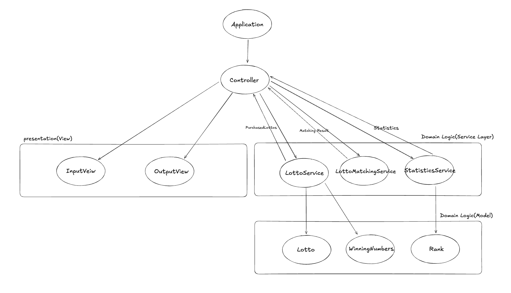

## 들어가며

우테코 8기 프리코스 3주차 미션이 공개되어 요구사항을 분석하고 설계하는 과정을 기록해보려 한다.

## 과제 진행 요구사항
이전 주차와 동일하다.

## 프로그래밍 요구사항
이번 프로그래밍 요구사항에는 2주차와 다르게 추가된 부분이 있는데

추가된 부분은 다음과 같다. 
1. 함수(또는 메서드)의 길이가 15라인을 넘어가지 않도록 구현한다.
2. 함수(또는 메서드)가 한 가지 일만 잘 하도록 구현한다.
3. else 예약어를 쓰지 않는다.
4. Java Enum을 적용하여 프로그램을 구현한다.
5. 구현한 기능에 대한 단위 테스트를 작성한다. 단, UI(System.out, System.in, Scanner) 로직은 제외한다.

### 백엔드 공통 피드백 
2주차가 끝난 후 디스코드에 백엔드 공통 피드백이 올라왔고 내용은 다음과 같다.

- 스페이스와 탭을 혼용하지 않는다
- 기능 목록을 재검토한다
- 기능 목록을 업데이트한다
- 값을 하드 코딩하지 않는다
- 구현 순서도 코딩 컨벤션이다
- 변수 이름에 자료형은 사용하지 않는다
- 한 메서드가 한 가지 기능만 담당하게 한다
- 메서드가 한 가지 기능을 하는지 확인하는 기준을 세운다
- 처음부터 큰 단위의 테스트를 만들지 않는다

전체적으로 이제 학습했던, 보고 배운 것들을 최대한 적용하고 클린하게 코드를 짜야한다는 느낌이 나기 때문에 이번 3주차에서 배운 것을 최대한 응용해보아야겠다.

## 기능 요구사항 
3주차에는 간단한 로또 발매기를 구현하는 미션이고 기능 요구 사항은 다음과 같다.

- 로또 번호는 1~45 범위의 숫자로 구성된다.
- 1개의 로또는 중복되지 않는 6개의 숫자로 구성된다.
-  당첨 번호 추첨 시 중복되지 않는 숫자 6개와 보너스 번호 1개를 뽑는다.
-  당첨은 1등~5등까지 있으며, 각 등수의 기준과 상금은 다음과 같다.
  - 1등: 6개 번호 일치 / 2,000,000,000원
  - 2등: 5개 번호 + 보너스 번호 일치 / 30,000,000원
  - 3등: 5개 번호 일치 / 1,500,000원
  - 4등: 4개 번호 일치 / 50,000원
  - 5등: 3개 번호 일치 / 5,000원
-  로또 1장 가격은 1,000원이다.
-  사용자가 구입 금액을 입력하면 해당 금액에 맞는 로또를 발행해야 한다.
-  당첨 번호와 보너스 번호를 입력받는다.
-  사용자가 구매한 로또 번호를 당첨 번호와 비교하여 당첨 내역 및 수익률을 출력한다.
-  로또 게임을 종료한다.
-  잘못된 입력값이 들어올 경우 `IllegalArgumentException`을 발생시킨다.
-  예외 발생 시 `[ERROR]`로 시작하는 에러 메시지를 출력하고 해당 입력부터 다시 받는다.
-  `Exception`이 아닌 명확한 예외 유형(`IllegalArgumentException`, `IllegalStateException`)만 사용한다.

Enum 타입을 사용해야하기도하고 재입력과 같은 로직들 까지 처리해야하기 떄문에 설계에 최대한 많은 시간을 들여서 개발을 해야겠다.

## 설계 과정
### 기능 요구사항 분석
설계를 시작하기 전에 먼저 기능 요구사항에서 저번처럼 명사와 동사를 분리해보면 다음과 같다. 

객체 후보군(명사)
- 로또 (여러 장)
- 로또 번호 (1~45, 6개)
- 당첨 번호 (6개)
- 보너스 번호 (1개)
- 등수 (1~5등)
- 상금
- 구입 금액
- 수익률
- 당첨 통계

행위 후보군(동사)
- 발행하다 (로또를)
- 생성하다 (로또 번호를)
- 입력하다 (구입 금액, 당첨 번호, 보너스 번호를)
- 검증하다 (입력값을)
- 비교하다 (로또 번호와 당첨 번호를)
- 판정하다 (등수를)
- 계산하다 (수익률을)
- 출력하다 (로또, 당첨 통계, 수익률을)
- 발생시키다 (예외를)
- 재입력하다

### 클래스 후보 도출 
추출한 명사와 동사를 바탕으로 클래스를 설계해보자. 확실히 요구사항이 복잡하고 많다보니 분리를해도 양 자체가 많은 것을 알 수 있다. 그래도 유의미한 것을 추출해보면 

도메인에는 이 정도로 요약할 수 있을 것 같은데 나머지 구입 금액, 통계들까지 클래스로 만들어버리면 코드의 양 자체가 너무 많을 것 같고 아예 비즈니스 로직이나 저번처럼 dto로 처리해버리는 것이 낫지 않을까 생각해본다.

1. 로또에 있는 로또 번호와 보너스 번호
2. 당첨 번호와 당첨 번호와 당첨 보너스 번호
3. 등수와 상금

어느정도의 큰 그림을 대략적으로 그려보면 

1. InputView
2. OutputView
3. Controller
4. Lotto(6개의 번호와 1개의 보너스 번호)
5. WinningLotto(6개의 번호와 1개의 보너스 번호)
6. Rank(등수를 표현하는 클래스인데 enum으로 구현해야 요구사항을 정확이 이해한 것일 것 같다. enum 내부에는 등수와 상금 정도 있으면 될 것 같다.)

그 다음에 이제 dto들을 설계해야하는데 아무래도 구매한 로또들의 집합들을 만들어야하니 
7. PurchasedLotto?
그 다음엔 위에서 얘기한 출력을 위한 통계 문자열 dto
8. Statistics?

이렇게 두고 나머지를 전부 서비스 레이어에서 처리하면 될 것 같다. 

### User flow 
이번 미션에서는 사용자가 입력을 크게 두 번 하게 되는데 

첫 번째는 구입 금액 입력 
두 번째는 당첨 번호 입력 

이렇게 하게 된다.

따라서 구입 금액을 입력했을 떄 컨트롤러에서 inputview를 호출하고 다시 컨트롤러에서 입력값을 받아 로또들을 발행(서비스 레이어에서)해서 다시 컨트롤러로 간 다음 outputview에서 출력하는 방식으로 설계하는 것이 내가 정의한 MVP에 가장 올바른 모습인 것 같다.

또한 당첨 번호도 똑같이 입력하고 여기서 등수들을 출력하면 되는데 아무래도 당첨 결과와 수익률을 바로 출력해야되다보니 도메인과 컨트롤러를 얇게 가져가돼 서비스를 엄청 두껍게 설계해야할 것 같다.

### Service Layer
서비스 레이어에서는 발행, 매칭, 통계를 분리해서 작성하면 될 것 같다. 따라서 네이밍을 해보자.
- LottoService
- LottoMatchingService
- StatisticsService

### 클래스 구조도
이 정도로 설계를 해보고 클래스 구조도를 그려보면 이 정도로 나올 것 같다. 

## 마치며
1주차 2주차에 그렸던 구조도를 보다가 3주차의 구조도를 보니 훨씬 쓸만해진 것 같다. 코드의 양이 많아지고 요구사항이 복잡해질 것 같아서 검증을 정말 많이 해야할 것 같은 느낌이 든다. 