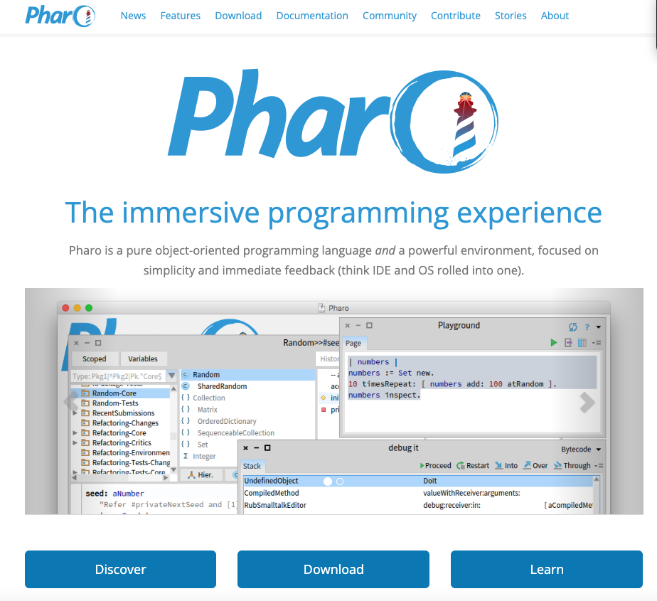
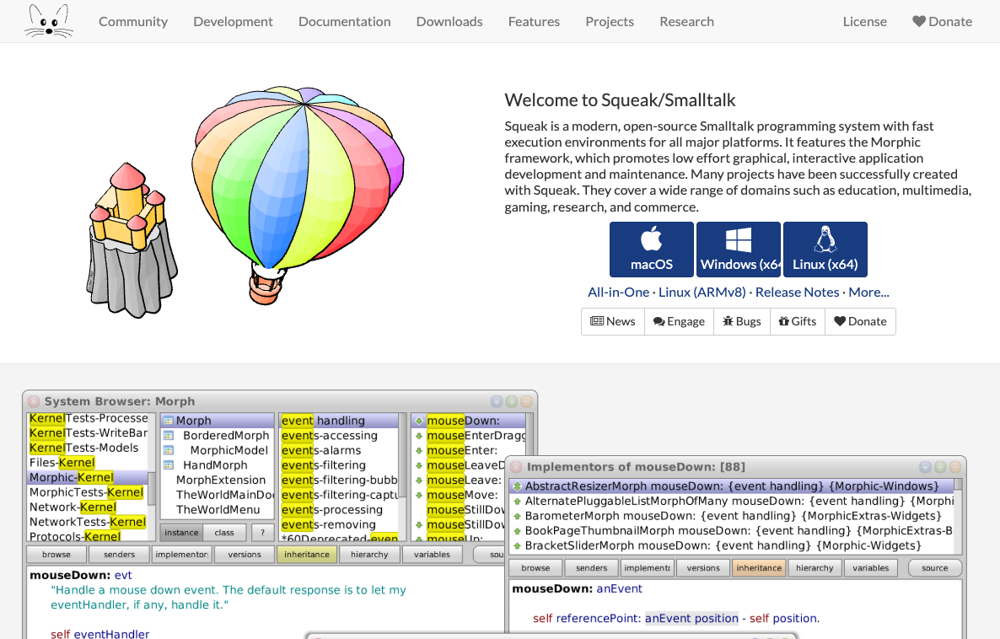
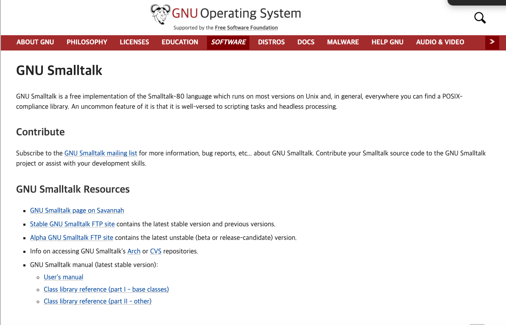
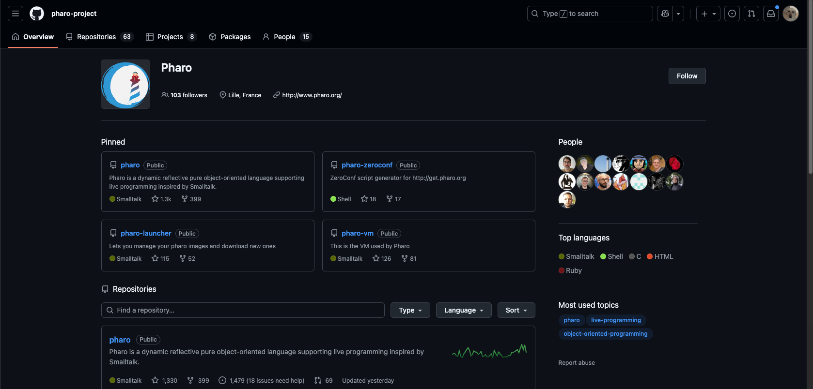
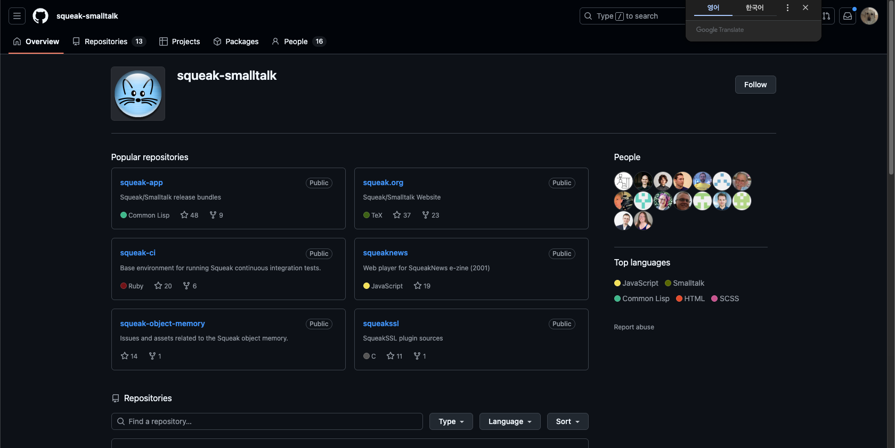
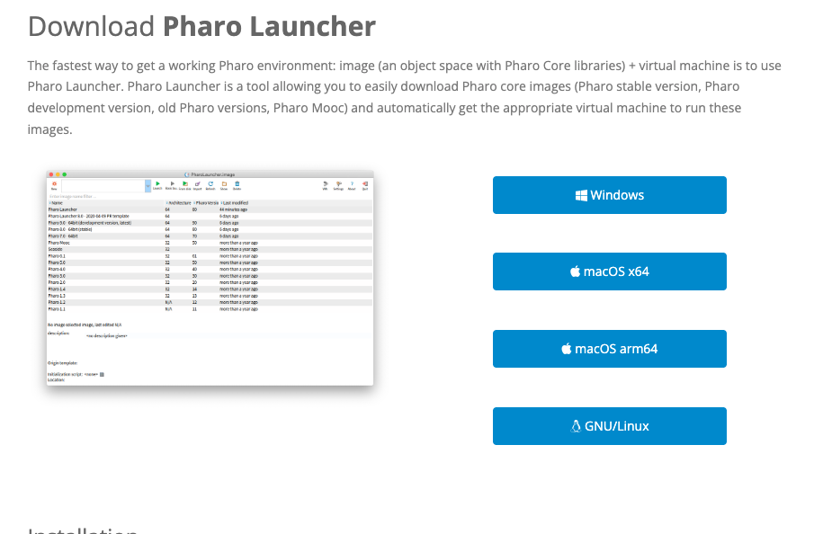
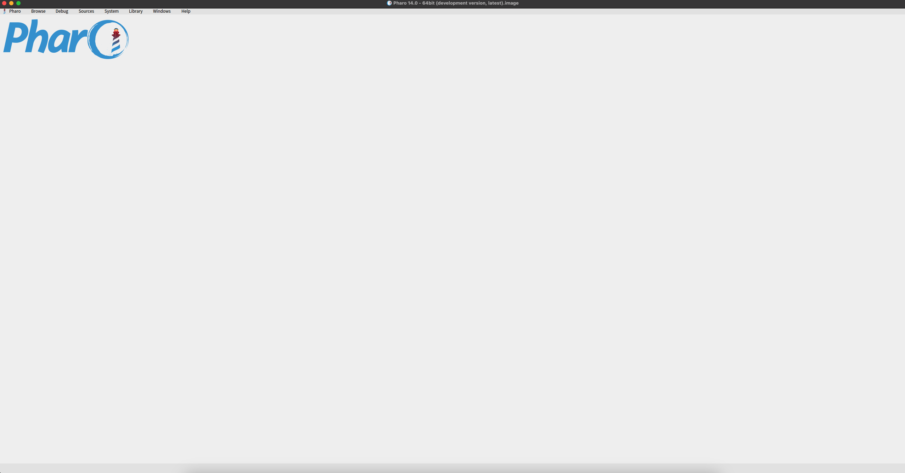
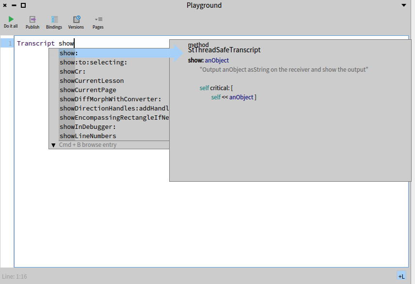
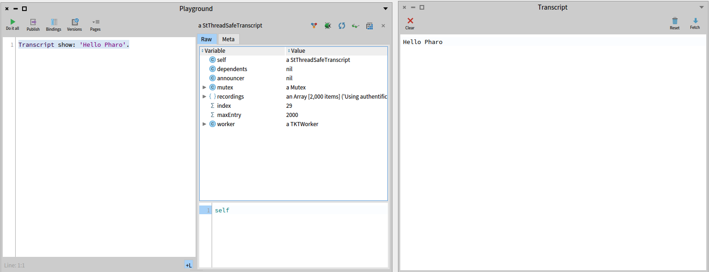

## 들어가며
Smalltalk 80을 활용한 테트리스를 개발하기로 결정하고 이를 위해서 개발환경을 세팅하는 과정을 기록해보려한다.

## IDE
우리가 C 계열 언어를 개발할 때나 Python, Java/Kotlin을 개발할 때 각 언어마다 특화된 IDE가 존재하듯 Smalltalk 역시 시간이 지나면서 여러 형태의 개발 환경이 생겨났다. Smalltalk-80의 핵심 철학은 **코드와 객체 세계가 항상 살아있는 상태에서 직접 조작한다**는 것이었고 당시에는 이 철학을 기반으로 한 독립적인 이미지 기반 IDE를 사용했다.

Smalltalk에서 IDE는 내가 아는 것과 달리 단순한 편집기가 아니었다. VM 위에서 실행 중인 객체들을 그대로 보여주고, 그 객체들을 브라우저와 인스펙터로 탐색하며, 디버거에서 코드를 수정하면 즉시 실행 상태에 반영되는 라이브 프로그래밍 환경 자체를 의미한다. Smalltalk 시스템은 언어,라이브러리, 데스크탑 환경이 하나의 이미지 안에 함께 포함된 형태로 발전해왔다.

현재에는 Smalltalk을 기반으로 개발을 진행할 때 주로 선택되는 IDE는 다음과 같다.

### Pharo


Pharo는 Squeak에서 파생된 현대 Smalltalk 환경으로 Smalltalk-80의 이미지 기반 개발 방식과 객체지향 철학을 그대로 유지하면서 UI, 도구, 문서가 현대화되어 있다. 코드 브라우저, 디버거, 인스펙터 등의 도구가 정교하고 Git 연동을 위한 Iceberg가 기본 포함되어 있어 프로젝트 개발에 가장 적합한 환경으로 평가된다고 한다.

### Squeak


Squeak은 Smalltalk-80의 전통을 가장 충실히 유지하는 구현체로 교육과 연구 목적에서 널리 쓰이는 환경이다. 레거시가 많고 Smalltalk 역사 자체에 가깝다는 점에서 의미가 있다. 그래픽 기능도 풍부해서 과거 Smalltalk 환경을 최대한 원형에 가깝게 경험하고 싶을 때 선택된다고 한다.

### GNU Smalltalk 

GNU Smalltalk은 이미지 기반 IDE 대신 파일 기반, 터미널 중심 워크플로를 제공하는 구현체이다. Smalltalk 문법을 그대로 사용하지만 개발 방식은 스크립트 언어나 C, Python에 더 가깝고 Smalltalk-80의 라이브 개발 환경을 체험하려는 목적보다는 CLI 중심 개발을 선호할 때 선택된다고 한다.

## 그래서 어떤 걸 선택해야할까?
먼저 주어진 기간이 짧기떄문에 제일 우선적으로 살펴보아야할 것은 무엇보다 공식문서와 래퍼런스가 얼마나 잘 되어있는지이다. 그래서 GNU Smalltalk은 일단 제외시키고 남은 두 가지의 선택지중에 하나를 선택해야하는데, 다음은 두개의 github를 확인해본 사진이다.





두 개의 github를 비교해봤을 때 Pharo는 현재까지 꾸준하게 릴리즈되는 것을 확인할 수 있었다. 또한 Pharo는 공식 문서가 Squeak에 비해 더 깔끔하게 되어있고 사용법과 같은 것들을 훨씬 더 상세하게 명시해놨기 때문에 Pharo로 결정을 내리면 될 것 같다.

## Hello Pharo 


놀랍게도 Pharo는 MacOS의 amr64 아키텍쳐까지 지원하는 것을 확인할 수 있었다. 애플실리콘이 나온지가 얼마 안되어있는데 이것까지 정확히 지원하는 것을 보고 Pharo로 결정하길 잘했다는 생각이든다.

가이드에 안내된 대로 설치를 완료하면 아래와 같이 아무것도 뜨지 않는다.


그래서 워크 스페이스인 `playground`를 하나 만들어주고 다음의 코드로 Hello Pharo!를 찍어보면 된다. 

```smalltalk
Transcript show 'Hello Pharo!'.
```

여기서 `Transcript`는 전역 객체로 smalltalk 환경에서 콘솔의 역할을 한다. 또한 smalltalk 에서는 메시지로 각 객체끼리 서로 메시지를 주고받는데 여기서는 show라는 메시지를 사용한다. 

따라서 이 코드는 `Transcript` 라는 전역 객체 콘솔에 'Hello Pharo!' 문자열을 show 해달라 이렇게 해석하면 된다. 



코드를 작성하다가 자동완성이 너무 잘되어있어서 캡쳐해봤다. 솔직히 말해서 개발 생산성이 전혀 지원되지 않는다면 힘들 것 같았지만 다행이라는 생각도 든다.

코드를 완성하고 실행해보면 밑에와 같이 결과가 잘 출력 되는 것을 확인할 수 있다.



## 마치며
새로운 언어와 도구를 실행하는 것은 항상 설렌다. 다행히도 Pharo가 너무 잘되어있어서 내가 잘못하지 않는 이상 개발이 막힐일은 없을 것 같고 이제 smalltalk의 문법과 테트리스 구현을 위한 학습을 빠르게 병행하면 될 것 같다.