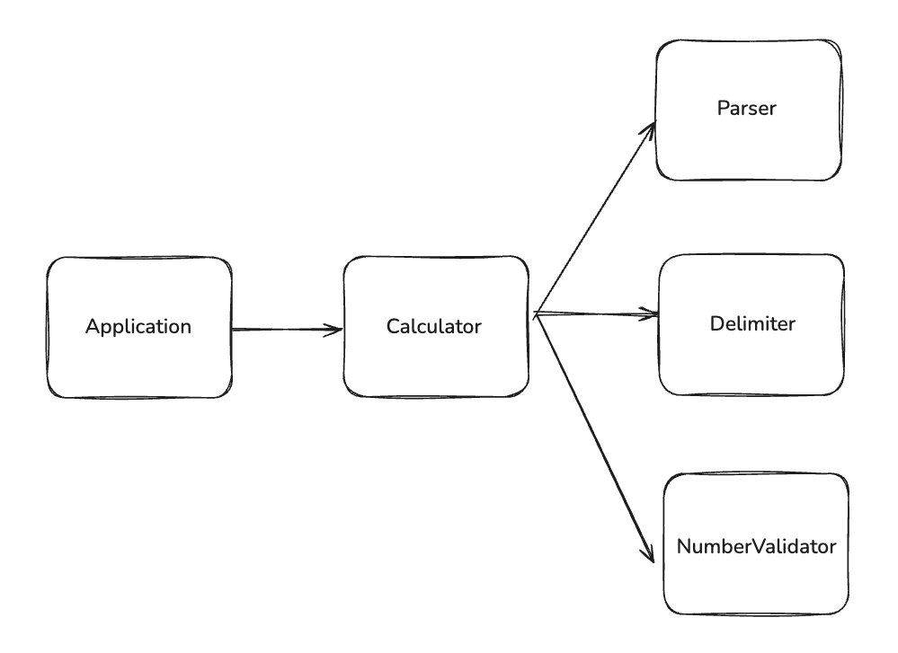

## Contents
- [Bulk Insert란?](#bulk-insert란)
- [Bulk Insert가 빠른 이유](#bulk-insert가-빠른-이유)
- [InnoDB Bulk Insert 최적화](#innodb-bulk-insert-최적화)

---

## Bulk Insert란?

여러 행(row)을 하나의 INSERT 문으로 한 번에 삽입하는 방식이다.

```sql
-- 단건 INSERT (3번 실행)
INSERT INTO users (name, age) VALUES ('kim', 99);
INSERT INTO users (name, age) VALUES ('yook', 99);
INSERT INTO users (name, age) VALUES ('choi', 99);

-- Bulk INSERT (1번 실행)
INSERT INTO users (name, age) VALUES 
  ('kim', 99),
  ('yook', 99),
  ('choi', 99);
```

공식 문서에서는 INSERT 속도 최적화의 핵심을 다음과 같이 설명한다:

> *"To optimize insert speed, combine many small operations into a single large operation. Ideally, you make a single connection, send the data for many new rows at once, and delay all index updates and consistency checking until the very end."*

즉, 여러 개의 작은 작업을 하나의 큰 작업으로 합치고, 인덱스 업데이트와 일관성 체크는 마지막에 한 번에 처리하는 것이 최적화의 핵심인 것이다.


## Bulk Insert가 빠른 이유

공식 문서에 따르면 INSERT 시 소요 시간 비율은 다음과 같다.



실제 데이터 삽입 비용(row 삽입, 인덱스 삽입)은 동일 하지만차이가 나는 건 연결, 쿼리 전송, 파싱, 종료 같은 부가 작업들이다.

> 테이블 크기가 커질수록 인덱스 삽입 비용은 log N으로 증가한다 (B-tree 인덱스 기준).

## InnoDB Bulk Insert 최적화

### 1. autocommit 끄기

InnoDB는 autocommit이 켜져 있으면 매 INSERT마다 redo log를 디스크에 flush한다. 따라서 대량 임포트 시에는 autocommit을 꺼야 한다.

```sql
SET autocommit=0;
... SQL import statements ...
COMMIT;
```

> mysqldump의 `--opt` 옵션을 사용하면 자동으로 최적화된 덤프 파일이 생성된다.

### 2. UNIQUE 체크 끄기

세컨더리 키에 UNIQUE 제약이 있다면 임시로 체크를 끈다. InnoDB가 change buffer를 사용해서 일괄 처리할 수 있어 디스크 I/O가 크게 줄어든다.

```sql
SET unique_checks=0;
... SQL import statements ...
SET unique_checks=1;
```

> 데이터에 중복 키가 없는지 반드시 확인해야 한다.

### 3. FOREIGN KEY 체크 끄기

FK 제약이 있다면 임시로 체크를 끈다.

```sql
SET foreign_key_checks=0;
... SQL import statements ...
SET foreign_key_checks=1;
```

### 4. AUTO_INCREMENT 락 모드 변경

auto-increment 컬럼이 있는 테이블에 대량 삽입 시, `innodb_autoinc_lock_mode`를 2(interleaved)로 설정한다.

- 1 (consecutive): 연속적인 값 보장, 락 오래 유지
- 2 (interleaved): 값이 연속적이지 않을 수 있지만, 락을 빨리 해제해서 동시성 향상

### 5. PRIMARY KEY 순서로 삽입

InnoDB는 클러스터링 인덱스를 사용하므로 PK 순서대로 삽입하는 것이 빠르다. 특히 테이블이 버퍼 풀에 전부 들어가지 않는 경우에 중요하다.

```sql
-- 권장: PK 순서대로 삽입
INSERT INTO users (id, name) VALUES 
  (1, 'kim'),
  (2, 'yook'),
  (3, 'choi');

-- 비권장: PK 순서 무시
INSERT INTO users (id, name) VALUES 
  (100, 'kim'),
  (2, 'yook'),
  (50, 'choi');
```

### 6. FULLTEXT 인덱스 최적화

FULLTEXT 인덱스가 있는 테이블에 데이터를 로딩할 때는:

1. 테이블 생성 시 `FTS_DOC_ID` 컬럼 정의
2. 데이터 로드
3. 데이터 로드한 후에 FULLTEXT 인덱스 생성

```sql
CREATE TABLE t1 (
  FTS_DOC_ID BIGINT UNSIGNED NOT NULL AUTO_INCREMENT,
  title VARCHAR(255) NOT NULL DEFAULT '',
  text MEDIUMTEXT NOT NULL,
  PRIMARY KEY (`FTS_DOC_ID`)
) ENGINE=InnoDB;

-- 데이터 로드 후 인덱스 생성
CREATE FULLTEXT INDEX ft_idx ON t1(title, text);
```

### 7. MySQL Shell 활용

대용량 파일을 빠르게 임포트하려면 MySQL Shell의 병렬 임포트 유틸리티를 사용한다.

- `util.importTable()`: 병렬 테이블 임포트
- `util.loadDump()`: 병렬 덤프 로딩

## Ref 
- [MySQL 8.0 Docs - Optimizing INSERT Statements](https://dev.mysql.com/doc/refman/8.0/en/insert-optimization.html)
- [MySQL 8.0 Docs - Bulk Data Loading for InnoDB Tables](https://dev.mysql.com/doc/refman/8.0/en/optimizing-innodb-bulk-data-loading.html)